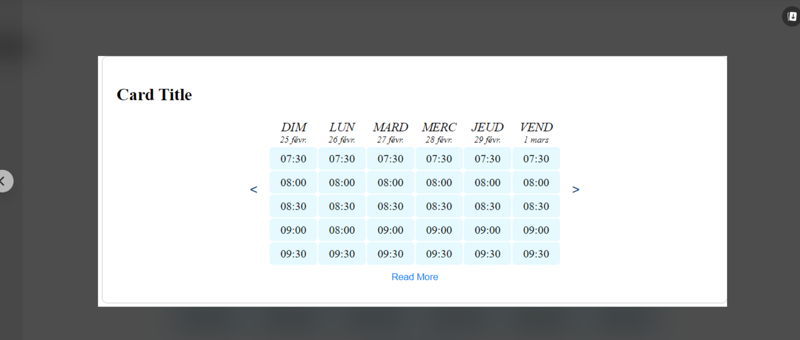

# Sa7ty

## Table of Contents

- [Introduction](#introduction)
- [Features](#features)
- [Installation](#installation)
- [Usage](#usage)
- [Contributing](#contributing)
- [License](#license)

## Introduction

Provide a more detailed introduction to your project. Explain what it does, its purpose, and any other relevant information.

## Class Diagram

## Features

List the key features of your project.

- Feature 1
- Feature 2
- ...

## Installation

- `composer require symfony/security-bundle`
- `symfony console doctrine:database:create`
- `composer require --dev orm-fixtures`
- `composer require fakerphp/faker --dev`
- `symfony console make:migration`
- `symfony console doctrine:migrations:migrate`
- `symfony console doctrine:fixtures:load`
- `symfony server:start`

# Health Care Symfony Twig

## Screenshots

